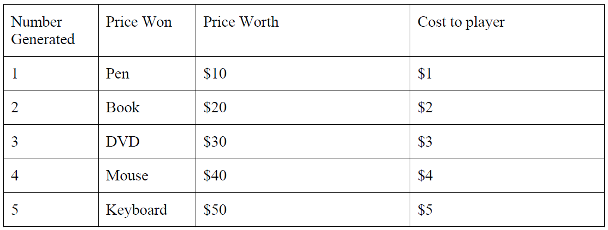
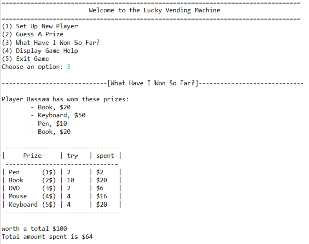

<h1 align="center">lucky vending machine</h1>
Lucky Vending Machine is game guess number between 1$ - 5$, and each number give prize with worth for prize between 10$ - 50$, If guess wrong number is loss money without prize, if guess correct number is won prize.

 

### **Option (1)**
asks the user to enter a name for the "player". The player’s name must not be blank. If this option is chosen again after a player has already been set up, a "new" player is created (ie. with a new name, no prizes, $0 spent). Note that the "new" player replaces the "old" player - ie. there is only ever one player at any one time.

 

### **Option (2)**
simulates a lucky guess operation. The computer generates a random number between 1-5. It then asks the player what prize he would like to win by trying to guess that number. The rules are :

* If the player guesses wrongly, he wins nothing and loses the money ($1-5).

* If the user enters a number which is less than 1, or more than 5, it will be rejected, and he does not lose any money.

 

### **Option (3)**
displays some statistics about the current player's prizes (and worths) and total amount spent..., such as :

 

### **Option (4)**
display rules of play

 

### **Option (5)**
exits the program. All player statistics will be cleared.

 

## **Additional Notes :**

* The menu will be displayed repeatedly, until the user chooses Option (5). Inputs other than 1-5 will be rejected, and an error message printed.

* If the user chooses Options (2) or (3), before a player has been set up, an appropriate error message will be printed.
